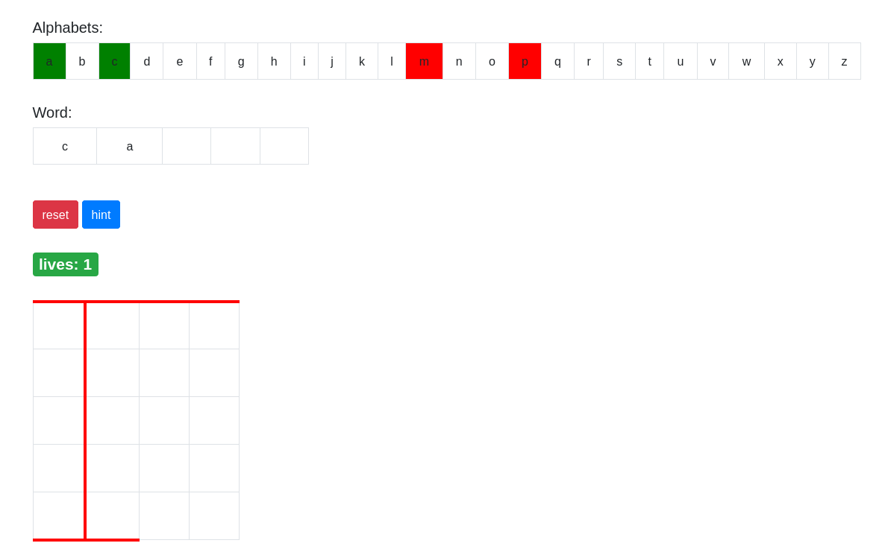

# Hangman game on Sinatra

### Description
this is my first web application on ruby which is the hangman game, simply implemented on [Sinatra](https://github.com/sinatra/sinatra) framework on backend also Bootstrap and JQuery on front-end. acutely this game is the "hw-sinatra-saas-hangperson" homework in the [SaaS book](http://www.saasbook.info/).
 
 

### Details
project is created from two main parts, backend and front-end. because of it's simple architecture and technologies, there's no need for much explains, the code is  commented and readable.
 
 

## Running the game:
install ruby on your system,

install sinatra framework,

install sinatra-contrib module,

run `git clone https://github.com/faramarzQ/hangman_game_on_sinatra.git`

run `cd hangman_game_on_sinatra`

run `ruby app.rb` to run the server and enjoy the game.